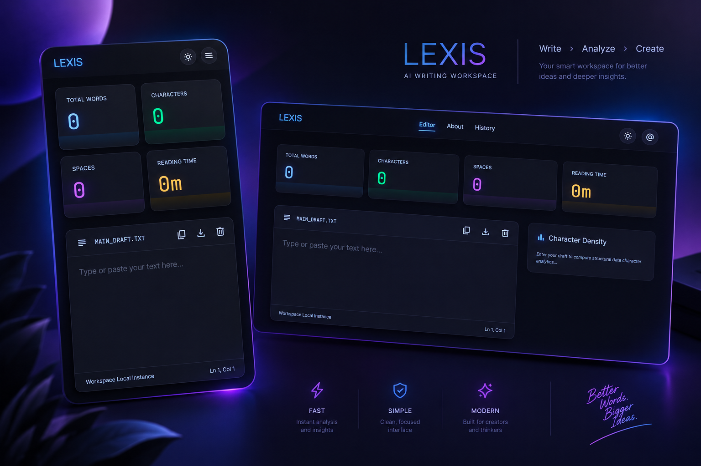

# ⚡ LEXIS

**Write › Analyze › Create**  
 _Your smart, privacy-focused workspace for better ideas and deeper text insights._

   

  

---

## 📌 Overview

**LEXIS** is a modern single-page web application engineered for real-time text analysis, structural character breakdown, and goal tracking. Built with a client-side architecture, LEXIS processes all data locally inside your browser ensuring maximum privacy, zero backend latency, and complete offline capability.

Whether you are drafting content, analyzing character frequencies, or tracking custom writing metrics, LEXIS provides a clean, responsive workspace tailored for creators and developers alike.

---

## ✨ Key Features

- **⚡ Real-Time Analytics:** Instant word count, character count, space calculation, and estimated reading time updates as you type.
- **📊 Deep Structural Analysis:** Detailed character frequency distribution, symbol breakdown, and alphabetical metrics.
- **🎯 Writing Goal Tracker:** Set dynamic word count targets with visual progress feedback.
- **💾 Local History & Drafts:** Automatic debounced draft auto-saving with instant loading and session restoration via LocalStorage.
- **📱 Responsive Bento UI:** Modern card-based UI optimized across desktop and mobile screens with light and dark mode toggling.
- **🔒 100% Privacy-Focused:** Zero server uploads—your draft data never leaves your client browser.

---

## 🛠️ Tech Stack

| Domain                 | Technology                                                   |
| :--------------------- | :----------------------------------------------------------- |
| **Frontend Framework** | Plain JavaScript (ES6+), Custom Web Components (`wc-router`) |
| **Styling**            | Tailwind CSS (Semantic Design Tokens)                        |
| **Icons & Typography** | Material Symbols, Inter Font                                 |
| **Storage & State**    | Browser LocalStorage API                                     |
| **Deployment**         | Netlify                                                      |

---

## 📄 License

Distributed under the [MIT](LICENSE) License. See LICENSE for more information.
